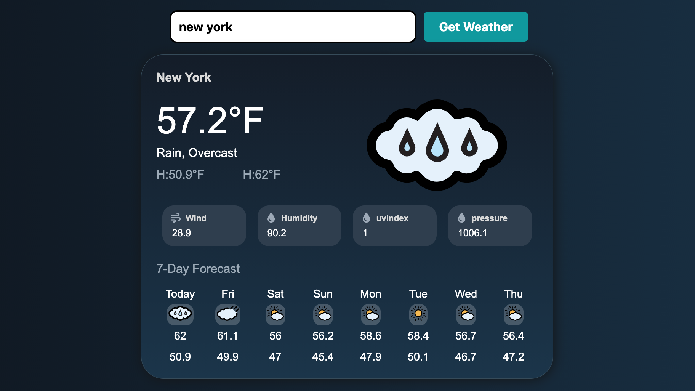

# Odin Weather App 🌦️

A simple weather app built for The Odin Project. It lets you search for a city and shows current conditions plus a 7-day forecast with dynamic weather icons.

🔗 **Live demo:** https://maxkamenskii.github.io/odin-weather-app/



## Features
- Search by city name
- Current temperature, wind, humidity, pressure
- 7-day forecast with icons
- Built with Webpack

## Tech stack
- HTML, CSS, JavaScript
- Webpack
- Visual Crossing Weather API

## Run locally
```bash
git clone https://github.com/MaxKamenskii/odin-weather-app.git
cd odin-weather-app
npm install
npm run build
npm run start   # or: npx webpack serve
